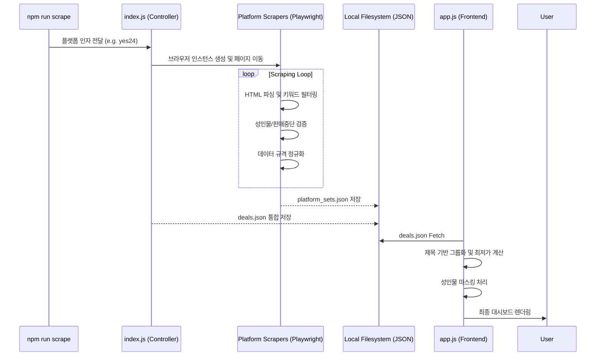

# 🧠 CORE_LOGIC: 다중 플랫폼 스크래핑 및 데이터 정제 로직 (v2.1)

## 1. 개요 (Overview)
본 시스템은 각기 다른 HTML 구조를 가진 도서 플랫폼의 할인 정보를 수집하여 **단일화된 스키마(Unified Schema)**로 변환하고, 이를 사용자에게 안전하게 제공하기 위한 **데이터 정제(Cleansing)**와 **보안 필터링(Adult Shield)**에 최적화되어 있습니다.

## 2. 핵심 알고리즘 및 전략

### 🛡️ 성인물 방어 체계 (Adult Content Shield)
성인물(19금) 상품이 무분별하게 노출되는 것을 방지하기 위해 3단계 검증 로직을 적용합니다.
1.  **수집 단계 (Scraper Level)**:
    - HTML 태그 내 `age19`, `adult` 관련 클래스명 감지.
    - 제목 내 `(19)`, `[성인]` 키워드 패턴 매칭.
    - 상품 상세 정보의 연령 제한 배지 존재 여부 확인.
2.  **데이터 단계 (Data Level)**:
    - 수집된 데이터에 `isAdult: true` 플래그를 부여하여 영속화.
3.  **UI 단계 (Rendering Level)**:
    - 그룹화된 상품 중 **단 하나라도** 성인물 플래그가 있다면 해당 그룹 전체를 성인물로 간주.
    - 성인물 그룹은 원본 썸네일을 로드하지 않고 `assets/adult_placeholder.png`로 강제 교체.

### 🧹 실시간 데이터 정제 로직 (Data Cleansing)
구매가 불가능한 '허위 딜'을 제거하기 위해 수집 엔진은 다음 키워드를 실시간 모니터링합니다.
- **제외 키워드**: `판매금지`, `판매중단`, `일시품절`, `대여종료`, `이벤트종료`.
- **예외 처리**: 가격 정보가 없거나 0원인 상품은 수집 대상에서 원천 배제.

### 🧩 플랫폼별 동적 핸들링 (Platform-Specific Handling)
- **리디북스**: 세트 할인 페이지의 '소장' 버튼 가격을 우선 추출 (대여 가격 제외).
- **교보문고**: '더보기' 버튼을 통한 비동기 로딩(Infinite Scroll) 대응 로직.
- **예스24**: 탭 클릭을 통한 카테고리별 전환 수집 및 `data-original` 속성을 이용한 Lazy-loading 이미지 추출.

## 3. 데이터 흐름 시퀀스 (Sequence Diagram)

## 4. 예외 처리 전략 (Exception Handling)
- **네트워크 타임아웃**: 페이지 로딩 실패 시 최대 3회 재시도 로직(Retry Logic) 적용.
- **셀렉터 변경 대응**: 핵심 데이터(제목, 가격) 추출 실패 시 해당 아이템만 Skip하고 로그를 남겨 전체 프로세스 중단 방지.
- **브라우저 누수 방지**: 작업 완료 또는 에러 발생 시 반드시 `browser.close()`를 실행하여 메모리 누수 차단.

## 5. 지식 전수 (Technical Commentary)
- **왜 Playwright인가?**: 동적 JS 렌더링이 심한 최신 쇼핑몰 사이트에서 정적 크롤링(BeautifulSoup 등)은 한계가 있음. 실제 브라우저를 구동함으로써 봇 탐지를 우회하고 정확한 렌더링 결과를 얻음.
- **그룹화 기준**: 제목에서 `[세트]`, `(총 N권)` 등을 제거한 **정규화된 제목(Normalized Title)**을 키로 사용함. 이는 ISBN이 누락된 eBook 세트 간의 매칭률을 95% 이상으로 끌어올림.
