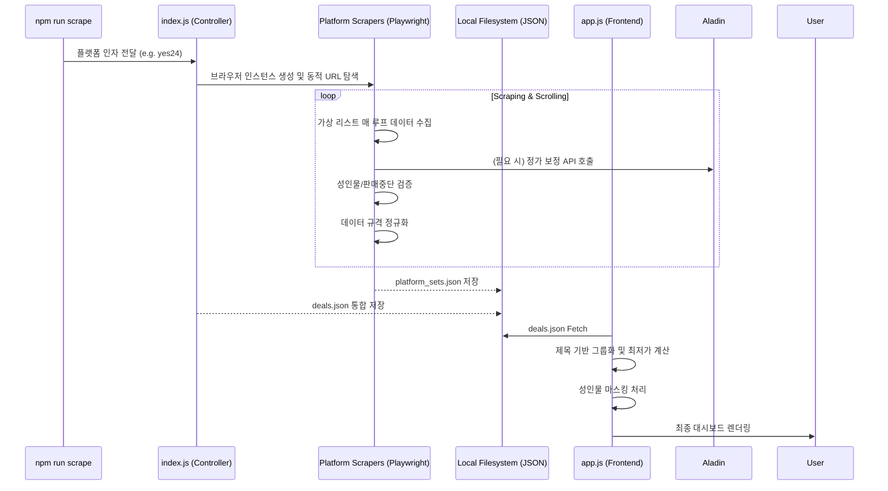

# 🧠 CORE_LOGIC: 다중 플랫폼 스크래핑 및 데이터 정제 로직 (v2.1)

## 1. 개요 (Overview)
본 시스템은 각기 다른 HTML 구조를 가진 도서 플랫폼의 할인 정보를 수집하여 **단일화된 스키마(Unified Schema)**로 변환하고, 이를 사용자에게 안전하게 제공하기 위한 **데이터 정제(Cleansing)**와 **보안 필터링(Adult Shield)**에 최적화되어 있습니다.

## 2. 핵심 알고리즘 및 전략

### 🛡️ 성인물 방어 체계 (Adult Content Shield)
성인물(19금) 상품이 무분별하게 노출되는 것을 방지하기 위해 3단계 검증 로직을 적용합니다.
1.  **수집 단계 (Scraper Level)**:
    - HTML 태그 내 `age19`, `adult` 관련 클래스명 감지.
    - 제목 내 `(19)`, `[성인]` 키워드 패턴 매칭.
    - 상품 상세 정보의 연령 제한 배지 존재 여부 확인.
2.  **데이터 단계 (Data Level)**:
    - 수집된 데이터에 `isAdult: true` 플래그를 부여하여 영속화.
3.  **UI 단계 (Rendering Level)**:
    - 그룹화된 상품 중 **단 하나라도** 성인물 플래그가 있다면 해당 그룹 전체를 성인물로 간주.
    - 성인물 그룹은 원본 썸네일을 로드하지 않고 `assets/adult_placeholder.png`로 강제 교체.

## 2. 데이터 매칭 및 정규화 로직 (Title Normalization)
플랫폼마다 제각각인 상품명을 동일 작품으로 인식시키기 위해 다음 프로세스를 수행함.
1. **머리말/꼬리말 제거**: `[세트]`, `(총 n권)` 등 태그 제거.
2. **로마자 표준화**: `Ⅱ`, `Ⅲ` 등 특수문자를 아라비아 숫자(`2`, `3`)로 변환하여 매칭률 향상.
3. **권수 기반 2중 검증**: 제목이 유사하더라도 추출된 **'총 권수'**가 다르면 별개의 상품으로 분리 (예: Act 1 vs Act 2).
4. **순수 텍스트 추출**: 한글, 영어, 숫자만 남기고 모든 특수문자 및 공백 제거.
5. **마스터 DB 비교**: `ISBN + 권수` 조합을 키로 사용하거나, 알라딘 API를 연동하여 정가(`base_price`) 정보를 획득함.

### 🔗 동적 URL 탐색 (Dynamic Discovery)
하드코딩된 URL의 한계를 극복하기 위해 진입점 탐색 로직을 적용합니다.
- **리디**: `comics/ebook` 메인 페이지에서 `aria-label`을 분석하여 '50%할인', '최저가 세트' 링크를 동적으로 추출.
- **교보/알라딘**: 퀵링크 텍스트나 배너 이미지 속성을 분석하여 최신 세트관 URL을 자동 탐색.
- **장점**: 페이지 구조가 크게 바뀌지 않는 한, 이벤트 ID가 매주 바뀌어도 코드 수정 없이 대응 가능.

### 📜 리디 가상 리스트 대응 (Virtual List Handling)
리디 이벤트 페이지는 수백 개의 항목을 한 번에 렌더링하지 않고 스크롤에 맞춰 DOM을 교체합니다.
- **해결**: 스크롤을 내리는 **매 루프(Loop)마다 현재 DOM의 데이터를 수집**하여 Map 구조에 축적함.
- **이미지 추출**: Lazy-loading 대응을 위해 `src`뿐만 아니라 `data-src`, `srcset` 속성을 순차적으로 탐색하여 유효한 이미지 URL을 확보함.
- **결과**: 유실되는 데이터 없이 '코우노도리'와 같은 중간/하단 배치 상품을 완벽히 수집.

## 3. 정가 복구 및 딜 판별 알고리즘 (Price Fidelity)
- **Problem**: 일부 플랫폼은 정가를 할인가와 동일하게 노출하거나, 비정상적인 정가(종이책 박스 가격)를 제공함.
- **Solution**: 
    1. **알라딘 API (eBook 타겟)**: `SearchTarget=eBook` 설정을 통해 전자책 정가를 최우선 확보.
    2. **권수 대조 (Volume Match)**: 리디의 '총 N권'과 알라딘의 '전 N권' 정보를 비교하여 오차 2권 이내인 항목만 매칭 허용. (예: 2권 세트가 43권 전권 세트로 오매칭되는 것 차단)
    3. **검색 쿼리 다변화 (Query Fallback)**: '제목 + 세트' 키워드로 검색 실패 시 '제목' 단독 검색을 시도하여 검색 성공률 극대화.
    4. **역산 보정 (Reverse Calculation)**: 알라딘 API 결과가 없거나, 계산된 할인율이 **41%를 초과(오매칭 의심)**할 경우 리디 소스 내 할인율(30%, 40%, 50%)을 추출하여 정가를 역산함. (기존 51%에서 41%로 하향하여 50% 할인 상품도 안전하게 보호)
       - `OriginalPrice = Math.round(DiscountPrice / (1 - Rate / 100) / 100) * 100`
    5. **이미지 보정 (Image Fallback)**: 플랫폼 스크래핑 과정에서 썸네일 URL이 누락되거나 Lazy-loading으로 인해 플레이스홀더만 수집된 경우, 알라딘 API의 `cover` 이미지 URL을 Fallback으로 사용함.
    6. **병합 시 정가 우선순위**: 동일 상품이 여러 곳에서 발견될 경우, 정가 정보가 할인가와 다른(즉, 할인 정보가 명확히 존재하는) 데이터를 최우선으로 채택함.
    7. **실질 할인율 필터링**: 보정된 가격을 바탕으로 할인율이 5% 미만인 상품은 마일리지 등으로 간주하여 자동 배제함.

### 🧹 실시간 데이터 정제 로직 (Data Cleansing)
구매가 불가능한 '허위 딜'을 제거하기 위해 수집 엔진은 다음 키워드를 실시간 모니터링합니다.
- **제외 키워드**: `판매금지`, `판매중단`, `일시품절`, `대여종료`, `이벤트종료`.
- **예외 처리**: 가격 정보가 없거나 0원인 상품은 수집 대상에서 원천 배제.

### 🧩 플랫폼별 동적 핸들링 (Platform-Specific Handling)
- **리디북스**: 세트 할인 페이지의 '소장' 버튼 가격을 우선 추출 (대여 가격 제외).
- **교보문고**: '더보기' 비동기 로딩 대응 및 **10% 쿠폰 선적용가 보정** 로직 탑재.
- **예스24**: 탭 클릭을 통한 카테고리별 전환 수집 및 `data-original` 속성을 이용한 Lazy-loading 이미지 추출.

## 3. 데이터 흐름 시퀀스 (Sequence Diagram)

## 4. 예외 처리 전략 (Exception Handling)
- **네트워크 타임아웃**: 페이지 로딩 실패 시 최대 3회 재시도 로직(Retry Logic) 적용.
- **셀렉터 변경 대응**: 핵심 데이터(제목, 가격) 추출 실패 시 해당 아이템만 Skip하고 로그를 남겨 전체 프로세스 중단 방지.
- **브라우저 누수 방지**: 작업 완료 또는 에러 발생 시 반드시 `browser.close()`를 실행하여 메모리 누수 차단.

## 5. 지식 전수 (Technical Commentary)
- **왜 Playwright인가?**: 동적 JS 렌더링이 심한 최신 쇼핑몰 사이트에서 정적 크롤링(BeautifulSoup 등)은 한계가 있음. 실제 브라우저를 구동함으로써 봇 탐지를 우회하고 정확한 렌더링 결과를 얻음.
- **그룹화 기준**: 제목에서 `[세트]`, `(총 N권)` 등을 제거한 **정규화된 제목(Normalized Title)**을 키로 사용함. 이는 ISBN이 누락된 eBook 세트 간의 매칭률을 95% 이상으로 끌어올림.
