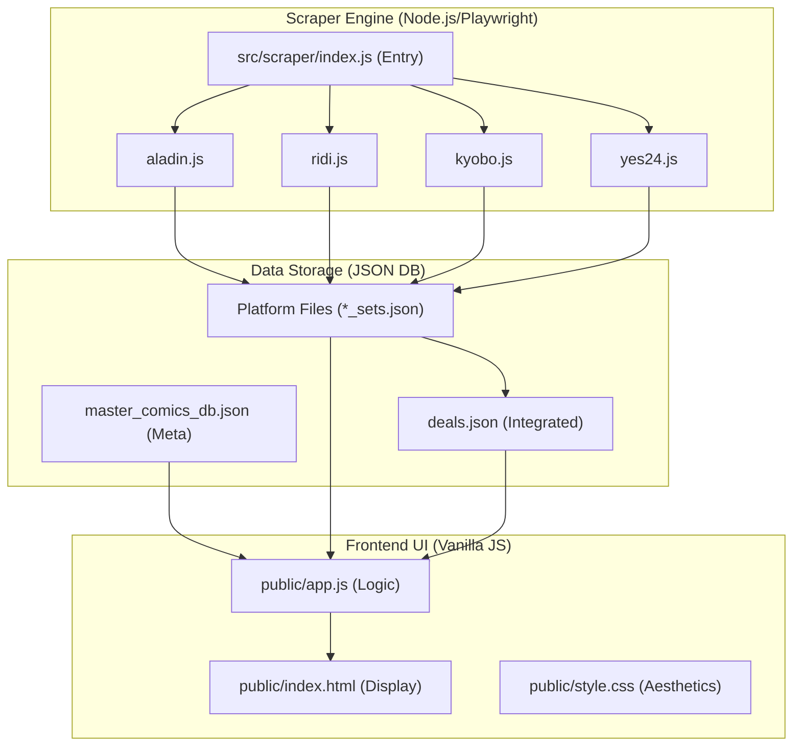

# 🗺️ SYSTEM_MAP (v1.1)

## 🏗️ 전체 아키텍처
본 프로젝트는 **Master DB (Aladin 기반)**를 중심으로 4대 주요 도서 플랫폼(알라딘, 리디북스, 교보문고, 예스24)의 실시간 할인 정보를 수집, 통합하여 최저가를 비교 분석하는 대시보드 시스템입니다.

### 🧩 주요 폴더 및 모듈 구조

### 📁 핵심 파일 역할 정의

#### 1. `src/scraper/` (데이터 수집부)
- **`index.js`**: 스크래핑 엔진의 메인 제어부. CLI 인자를 통해 전체 또는 특정 플랫폼(`npm run scrape:yes24` 등) 수집을 제어합니다.
- **`aladin.js`, `ridi.js`, `kyobo.js`, `yes24.js`**: 각 플랫폼별 이벤트 페이지를 Playwright로 탐색하여 **판매 중 상품** 및 **성인물 여부**를 판별하고 데이터를 정규화합니다.
- **`aladin_master.py`**: ISBN13 기반의 도서 메타데이터(작가, 카테고리 등)를 관리하는 파이썬 모듈입니다.

#### 2. `public/data/` (영속성 계층)
- **`master_comics_db.json`**: 시스템의 기준이 되는 도서 마스터 데이터베이스.
- **`*_sets.json`**: 각 플랫폼에서 방금 수집된 따끈따끈한 최신 할인 정보 파일. (수집 시마다 초기화됨)
- **`deals.json`**: 모든 플랫폼의 정보가 셔플링되어 담긴 통합 캐시 파일.

#### 3. `public/` (사용자 인터페이스)
- **`app.js`**: 플랫폼 간 데이터 병합(Grouping), 최저가 계산, 필터링(성인물, 검색) 핵심 로직 수행.
- **`style.css`**: 다크 모드 기반의 프리미엄 UI 디자인 및 플랫폼별 브랜드 컬러 테마 관리.

### 🛠️ 핵심 기술 스택
- **Scraper**: Node.js, Playwright (Headless Browser Automation)
- **Database**: Flat JSON Files (Source of Truth)
- **Frontend**: Vanilla Javascript (Modern ES6+), CSS Grid/Flexbox
- **Dev Tools**: npm Scripts (Platform-specific Execution)

### 🔗 데이터 라이프사이클
1. **Trigger**: 사용자가 `npm run scrape:[platform]` 실행.
2. **Collect**: Playwright가 해당 플랫폼의 "세트 할인/재정가" 페이지 접속.
3. **Filter**: '판매금지/품절' 키워드 필터링 및 '19금' 배지 감지.
4. **Normalize**: 제목, 가격, 이미지 URL을 시스템 공용 규격으로 변환.
5. **Merge**: `app.js`가 ISBN/제목을 기준으로 여러 플랫폼 정보를 하나의 카드로 통합.
6. **Display**: 최저가 플랫폼을 최상단에 노출하고 성인물은 Placeholder 이미지로 대체.
